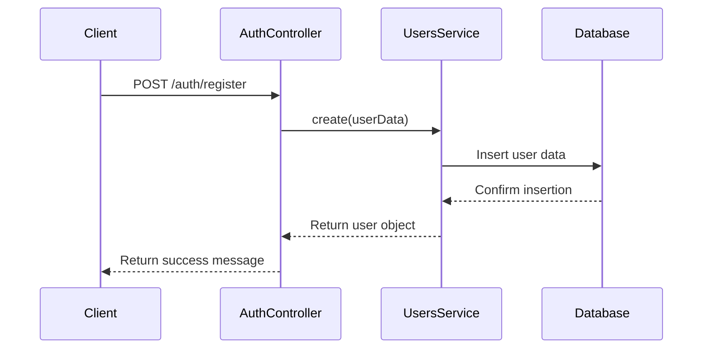
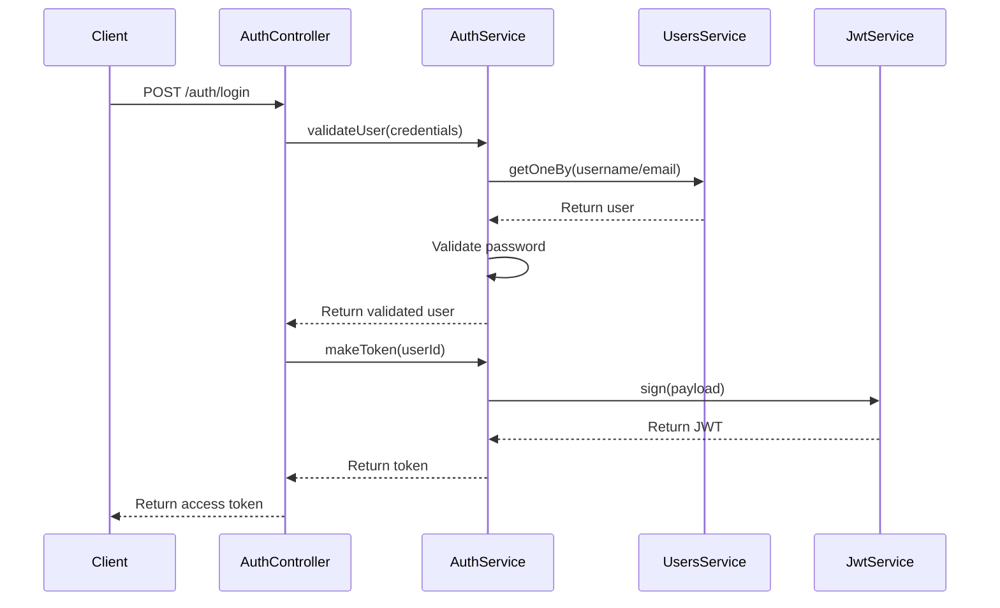
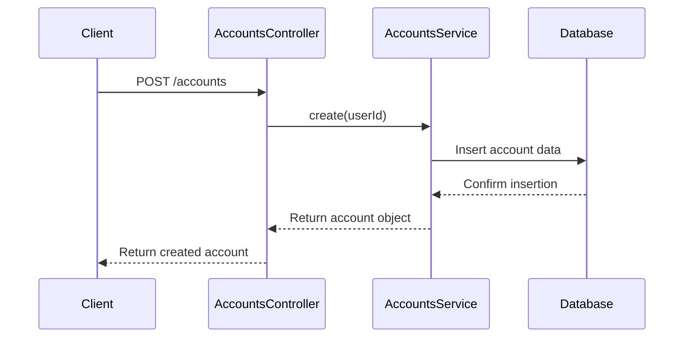
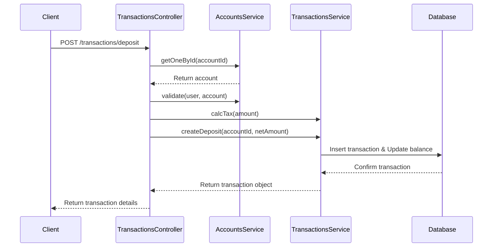

# FinTech API

## Project Description

The FinTech API is a robust and secure backend solution designed for financial technology applications. It provides a comprehensive set of features for user management, account handling, and transaction processing. Built with NestJS and leveraging modern web technologies, this API ensures high performance, scalability, and maintainability.

## Tech Stack

- **Framework**: NestJS
- **Language**: TypeScript
- **Database**: PostgreSQL
- **ORM**: Prisma
- **Authentication**: Passport.js, JWT
- **Validation**: Class Validator
- **API Documentation**: Swagger
- **Testing**: Jest
- **Containerization**: Docker
- **CI/CD**: GitHub Actions

## Project Architecture

The project follows a modular architecture based on NestJS best practices:

1. **Modules**: Each feature (Users, Accounts, Transactions, Auth) is encapsulated in its own module, promoting separation of concerns and maintainability.
2. **Controllers**: Handle incoming HTTP requests and define API endpoints.
3. **Services**: Contain business logic and interact with repositories.
4. **Repositories**: Abstract database operations and interact directly with the Prisma ORM.
5. **DTOs (Data Transfer Objects)**: Define the structure of data for requests and responses.
6. **Guards**: Implement authentication and authorization checks.
7. **Interceptors**: Handle cross-cutting concerns like serialization.
8. **Decorators**: Custom decorators for things like current user extraction.

## Project Structure

```
src/
├── auth/
├── users/
│   └── contacts/
├── accounts/
├── transactions/
├── database/
├── core/
│   └── serialize/
├── utils/
└── main.ts
```

This structure allows for easy navigation, scalability, and maintenance of the codebase. Each module (auth, users, accounts, transactions) contains its own controllers, services, and DTOs, keeping related functionality together.

## Features

### 1. User Management
- User registration and authentication
- Profile management (update details, change password, change email)
- Contact information management

### 2. Account Management
- Create and manage multiple accounts per user
- View account details and balance
- Close accounts

### 3. Transaction Processing
- Deposit funds
- Withdraw funds
- Transfer funds between accounts
- Transaction history and details

### 4. Security
- JWT-based authentication
- Role-based access control
- Password hashing and validation

## Sequence Diagrams

### User Registration



### User Login



### Create Account



### Deposit Transaction



## Getting Started

### Prerequisites

Before you begin, ensure you have the following installed:
- Node.js (v21.0.0 recommended)
- Yarn package manager
- Docker and docker-compose

### Installation

1. Clone the repository:
   ```bash
   git clone https://github.com/ahmdhusam/fintech.git
   cd fintech
   ```

2. Install dependencies:
   ```bash
   yarn install
   ```

3. Set up environment variables:
   - Create a `.env` file in the project root
   - Copy the contents from `.env.example` to `.env`
   - Modify the values as needed for your local setup

### Database Setup

1. Start the Docker containers:
   ```bash
   docker-compose up -d
   ```

   This will start the PostgreSQL database container.

2. Run database migrations:
   ```bash
   yarn prisma migrate dev
   ```

### Running the Application

1. Start the application in development mode:
   ```bash
   yarn start:dev
   ```

   The API will be available at `http://localhost:3000` by default.

2. For production builds:
   ```bash
   yarn build
   yarn start:prod
   ```

## Documentation

API documentation is available at `/api/docs` when the server is running, powered by Swagger.

## Testing

The project includes unit tests and e2e tests. Run tests using:

```bash
yarn test
yarn test:e2e
```

## Contributing

Contributions are welcome! Please feel free to submit a Pull Request.

## License

This project is licensed under the MIT License.